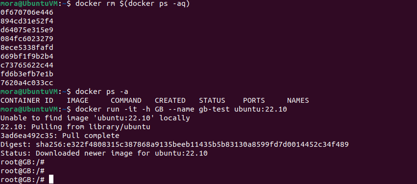

# Контейнеризация (семинары)


## Урок 3. Введение в Docker

### **Информация о проекте**

- Установить Docker
- Протестировать
- Хранение данных в контейнерах Docker

### Установка Docker

``` bash
sudo apt update

Установите пакеты, которые позволят использовать репозиторий по HTTPS:
sudo apt install apt-transport-https ca-certificates curl software-properties-common

Добавьте официальный GPG-ключ Docker
curl -fsSL https://download.docker.com/linux/ubuntu/gpg | sudo gpg --dearmor -o /usr/share/keyrings/docker-archive-keyring.gpg

Добавьте репозиторий Docker к списку источников пакетов
echo "deb [signed-by=/usr/share/keyrings/docker-archive-keyring.gpg] https://download.docker.com/linux/ubuntu $(lsb_release -cs) stable" | sudo tee /etc/apt/sources.list.d/docker.list > /dev/null

sudo apt update

Установите Docker
sudo apt install docker-ce

Добавьте вашего пользователя в группу docker, чтобы избежать использования sudo для запуска Docker команд
sudo usermod -aG docker $USER

Перезагрузите систему или запустите следующую команду, чтобы применить изменения в текущем сеансе
newgrp docker

Вы можете проверить его работу, выполнив команду
docker --version

```


### Тестирование Docker

Запустите контейнер с использованием образа "cowsay".

``` bash
docker run docker/whalesay cowsay Hello, Docker!

Запустить контейнер с рисунком слона:
docker run docker/whalesay cowsay -f elephant "Hello, Docker!"

Запустить контейнер с рисунком пингвина:
docker run docker/whalesay cowsay -f tux "Hello, Docker!"

Запустить контейнер с рисунком дракона:
docker run docker/whalesay cowsay -f dragon "Hello, Docker!"
```


Создание и запуск контейнеров:

- docker run: Запускает контейнер из образа.
- docker start: Запускает остановленный контейнер.
- docker stop: Останавливает работающий контейнер.
- docker restart: Перезапускает контейнер.
- docker exec: Выполняет команду внутри запущенного контейнера.

Управление контейнерами:

- docker rm $(docker ps -aq): удалит все остановленные контейнеры
- docker ps: Просмотр списка запущенных контейнеров.
- docker ps -a: Просмотр списка всех контейнеров (включая остановленные).
- docker rm: Удаляет контейнер.
- docker logs: Просмотр логов контейнера.

Работа с образами:

- docker images: Просмотр списка образов.
- docker pull: Загрузка образа с Docker Hub.
- docker build: Сборка образа из Dockerfile.
- docker rmi: Удаляет образ.


### Хранение данных в контейнерах Docker

Для начала давайте запустим контейнер из образа Ubuntu и войдем в него:

``` bash
docker run -it -h GB --name gb-test ubuntu:22.10
```



``` bash
Посмотрим содержимое корневой директории:
ls -l /

Создадим новую директорию в корне:
mkdir /example

Создадим файл "passwords.txt" и добавим в него какие-либо данные (представим, что это данные сайта или базы данных). Но что делать, если у нас нет редактора? Продолжим.
touch /example/passwords.txt
echo "123test" >> /example/passwords.txt
```


Давайте попробуем остановить контейнер и затем запустить его снова. Сохранятся ли наши данные?

``` bash
docker stop gb-test
docker start gb-test
docker exec -it gb-test bash
cat /example/passwords.txt
```


Рассмотрим наиболее интересный вариант - использование внешнего хранилища. Создадим директорию и подмонтируем ее к контейнеру:
``` bash
mkdir /test/folder
docker run -it -h GB --name gb-test -v /test/folder:/otherway ubuntu:22.10
```

Мы создали директорию и подмонтировали ее в контейнер, что позволило нам сохранить данные.

Добавим данные в подмонтированную директорию:
``` bash
echo "$HOSTNAME" >> /otherway/test.txt
```
Мы добавили данные в подмонтированную директорию.

Проверим доступность данных с локальной системы:
``` bash
cat /test/folder/test.txt
```
Удалим контейнер и создадим его снова, подмонтировав директорию:
``` bash
docker rm gb-test
docker run -it -h GB --name gb-test -v /test/folder:/otherway ubuntu:22.10
```

Мы видим, что данные по-прежнему доступны.


Самый надежный способ хранения данных в контейнерах - использование внешних хранилищ. Важно избегать хранения важных данных внутри контейнеров, чтобы предотвратить потерю информации.

*Подготовила студентка Geek Brains* [**`Эрина Ксения`**](https://github.com/MoraKsu)